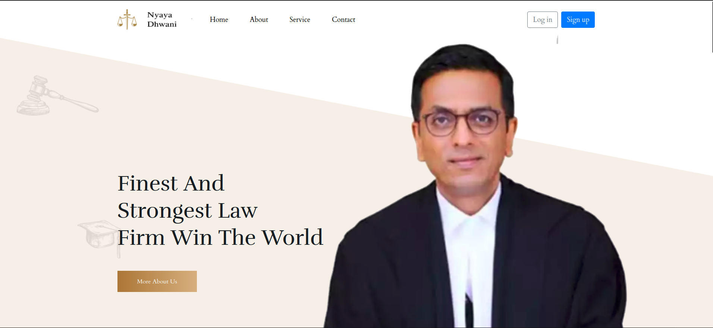
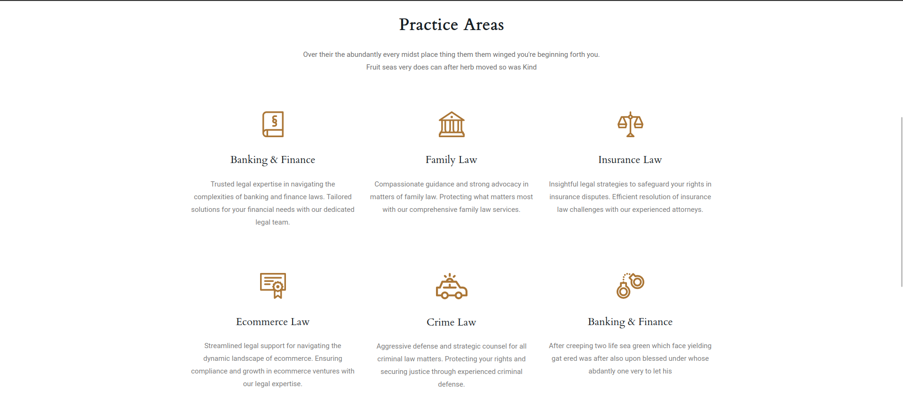
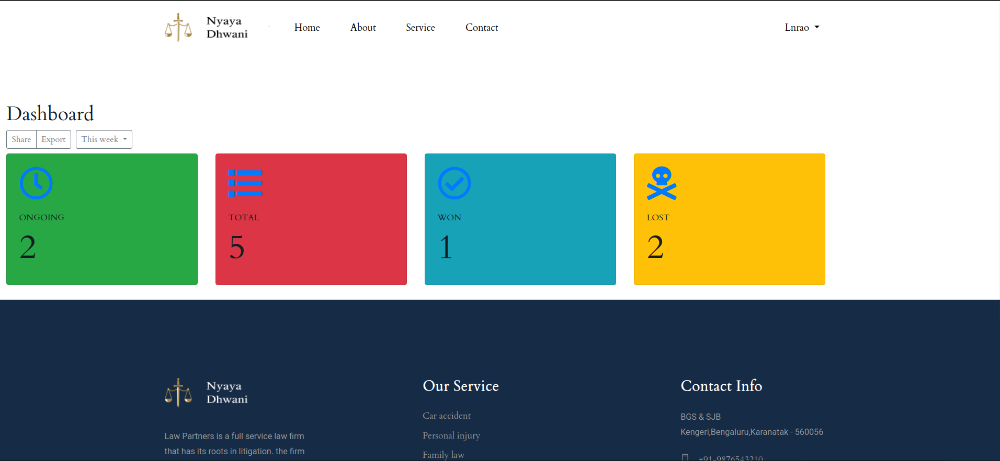
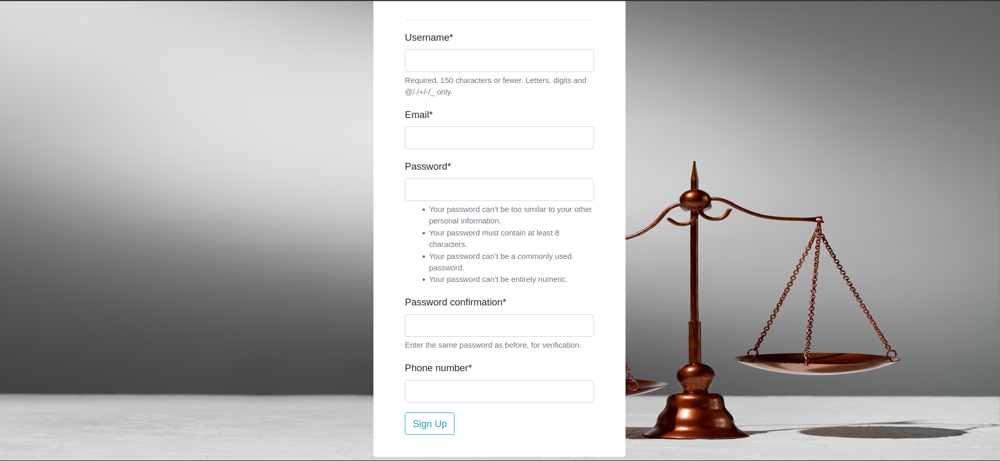
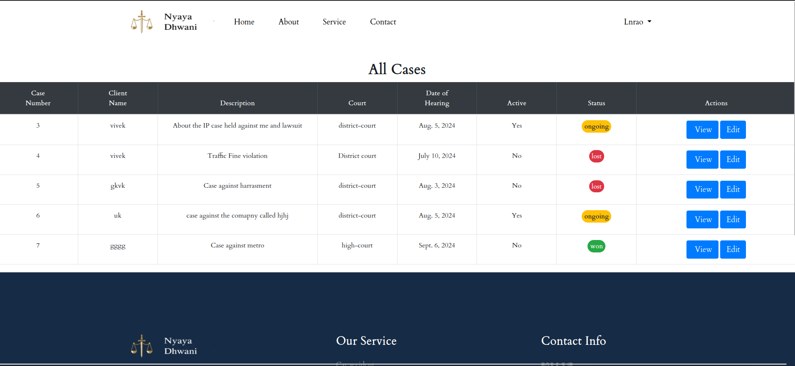

  # NyayaDhwani

  
  An online E-Portal for various type of case hearings
  is a web-based application built with the Django framework. This platform allows users to create and manage legal cases, while also enabling lawyers to oversee and manage these cases efficiently.

  ## [Live Demo!](https://nyayadhwani.pythonanywhere.com)
  ## Features
  
- **User Management**: Create and manage user accounts.
- **User Account Creation**: Users can register and create new accounts.
- **Case Management**: Users can create, update, and track their legal cases.
- **Lawyer Management**: Lawyers can view and manage cases assigned to them.
- **Role-Based Access**: Different permissions for users and lawyers.

## Prerequisites
- Python 3.8 or higher
- Django 4.0 or higher
- pip (Python package installer)

## Quick Guide

Follow the steps below to set up and run the web app:

1. Clone the repository:
   ```shell
   git clone https://github.com/viveknadig/nyayadhwani.git
   ```

2. Change into the project directory:
   ```shell
   cd nyayadhwani
   cd NyayaDhwani
   ```

3. Create a virtual environment:
	- Windows:
	```shell
	   python3 -m venv venv
   ```
	- Linux/Mac-OS:
	```shell
	   python3 -m venv venv
	```
4. Activate the virtual environment:
   - Windows:
     ```shell
     source venv\Scripts\activate
     ```
     
    - Linux/Mac-Os
     
		```shell
	   source venv\bin\activate
		```
5. Install the required dependencies:
   ```shell
   pip install -r requirements.txt
   ```

6. Create the database:
   ```shell
   python manage.py makemigrations
   ```

7. Apply database changes:
   ```shell
   python manage.py migrate
   ```
8. Create a Super User:
   ```shell
	python manage.py createsuperuser
	Username : admin
	Password : admin
	```
9. Start the server:
    ```shell
    python manage.py runserver
    ```
    (optional) Run on custom port number
    ```shell
	#For example: python manage.py runserver <port_number>
    python manage.py runserver 3000
    ```
10. Create Lawyers:
    ```
    create lawyers in admin panel: 

    Visit:
    
      127.0.0.1:8000/admin/
      (if you had given the port number :127.0.0.1:<port_number>/admin/)
    
    Under users create a Lawyer:
    
	  MAKE SURE THAT EMAIL ENDS WITH @nyayadhwani.com
      map type of lawyer under Dashboard
	  Lawyer_types
	  make sure that you create multiple lawyers for each type
    ```
## Screenshots:
`Home Page:`



`About Page:`



`Dashboard Page:`



`Sign UP Page:`



`Cases Page:`

